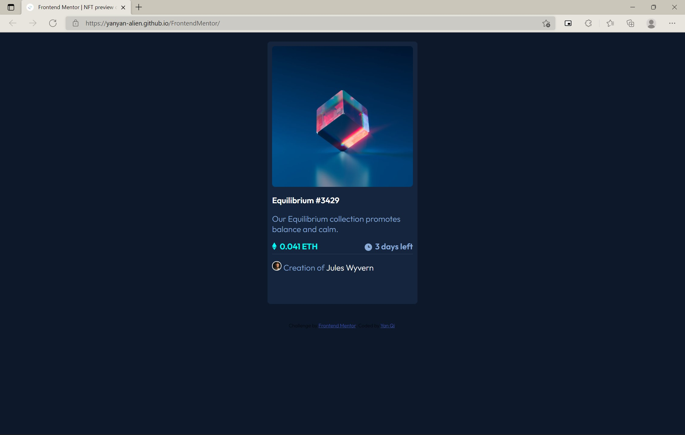

# Frontend Mentor - NFT preview card component solution

This is a solution to the [NFT preview card component challenge on Frontend Mentor](https://www.frontendmentor.io/challenges/nft-preview-card-component-SbdUL_w0U). Frontend Mentor challenges help you improve your coding skills by building realistic projects. 

## Table of contents

- [Overview](#overview)
  - [The challenge](#the-challenge)
  - [Screenshot](#screenshot)
  - [Links](#links)
- [My process](#my-process)
  - [Built with](#built-with)
  - [What I learned](#what-i-learned)
  - [Continued development](#continued-development)
  - [Useful resources](#useful-resources)
<!-- - [Author](#author) -->


## Overview

### The challenge

Users should be able to:

- View the optimal layout depending on their device's screen size (Not completed)
- See hover states for interactive elements (Completed)

### Screenshot



### Links

- Solution URL: [Github](https://github.com/yanyan-alien/FrontendMentor)
- Live Site URL: [Github Pages](https://yanyan-alien.github.io/FrontendMentor/)

## My process

### Built with

- Semantic HTML5 markup
- CSS custom properties
<!-- - Flexbox
- CSS Grid
- Mobile-first workflow -->


### What I learned
1. Able to change font style halfway using the ```<font>``` :
```html
<p class="create">
  Creation of <font color="#ffffff" class="name">Jules Wyvern</font>
</p>
```
2. Learnt the shorthand for background
```css
.nft:hover {
    background: no-repeat center/15% url("../images/icon-view.svg"), 
    linear-gradient(
        hsla(178, 100%, 50%, 0.603), 
        hsla(178, 100%, 50%, 0.603)
    ), 
    no-repeat center/100% url("../images/image-equilibrium.jpg");
    cursor: pointer; 
}
```
3. Width and height property are defined differently, and thus when using percentage with height it might not work as expected.


<!-- If you want more help with writing markdown, we'd recommend checking out [The Markdown Guide](https://www.markdownguide.org/) to learn more. -->


### Continued development

<!-- Use this section to outline areas that you want to continue focusing on in future projects. These could be concepts you're still not completely comfortable with or techniques you found useful that you want to refine and perfect. -->
- Responsive design since code in css usually in px
  - make use of media queries
- Transition when hovering over image using ease in 

### Useful resources

- [Mozilla Web Docs](https://developer.mozilla.org/en-US/) - This is reference material for html, css and perhaps javascript

<!-- - [Example resource 1](https://www.example.com) - This helped me for XYZ reason. I really liked this pattern and will use it going forward.
- [Example resource 2](https://www.example.com) - This is an amazing article which helped me finally understand XYZ. I'd recommend it to anyone still learning this concept.


## Author

- Website - [Add your name here](https://www.your-site.com)
- Frontend Mentor - [@yourusername](https://www.frontendmentor.io/profile/yourusername) -->

