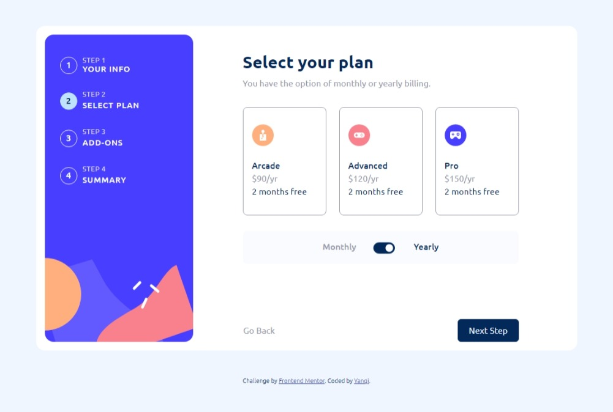

# Frontend Mentor - Multi-step form solution

This is a solution to the [Multi-step form challenge on Frontend Mentor](https://www.frontendmentor.io/challenges/multistep-form-YVAnSdqQBJ). Frontend Mentor challenges help you improve your coding skills by building realistic projects. 

## Table of contents

- [Overview](#overview)
  - [The challenge](#the-challenge)
  - [Screenshot](#screenshot)
  - [Links](#links)
- [My process](#my-process)
  - [Built with](#built-with)
  - [What I learned](#what-i-learned)
  - [Continued development](#continued-development)
  - [Useful resources](#useful-resources)


## Overview

### The challenge

Users should be able to:

- Complete each step of the sequence
- See a summary of their selections on the final step and confirm their order
- View the optimal layout for the interface depending on their device's screen size
- See hover and focus states for all interactive elements on the page

### Screenshot




### Links
- Live Site URL: [Github Pages](https://your-live-site-url.com)

## My process

### Built with

- Semantic HTML5 markup
- CSS custom properties
- Flexbox
- BootStrap5 (using CDN)

### What I learned

Instead of using a button to encapsulate the checkbox input, label is used as the container. This is because the issue of `Interactive controls must not be nested` and that nested interactive controls are not announced by screen readers. 

#### Why it matters? 

Focusable elements with an interactive control ancestor (any element that accepts user input such as button or anchor elements) are not announced by screen readers and create an empty tab stop. That is, you could tab to the element but the screen reader will not announce its name, role, or state. [Accessibility Issue Link](https://dequeuniversity.com/rules/axe/4.4/nested-interactive?application=axeAPI)


```html
<label for="" class="add-on-container" id="online-service">
  <input type="checkbox" name="online-service" id="">
  <span></span>
  <div class="add-on-text-wrapper">
    <div class="add-on-title">Online Service</div>
    <div class="add-on-description">Access to multiplayer games</div>
  </div>
  <div class="add-on-price">+$10/yr</div>
</label>
```

To use `display: flex;` and `align-self: center;` when trying to align a single column with another column with 2 or more rows within it.
```css
#sidebar .step {
  display: flex;
}

.step-circle {
  align-self: center;
}
```

### Continued development

- Clean up JavaScript and CSS
- Add error element when user did not choose a plan but proceeded on to click the next button
- Checkbox border colour
- Alignment of content in both views
- Styling of navigation buttons in mobile view


### Useful resources

- [Explaination of margin-top auto](https://www.reddit.com/r/webdev/comments/5ttih0/why_does_margintopauto_and_marginbottom_auto_not/) - Setting `margin-top: auto;` and `margin-bottom: auto;` gives **0px** as height is calculated differently from width.