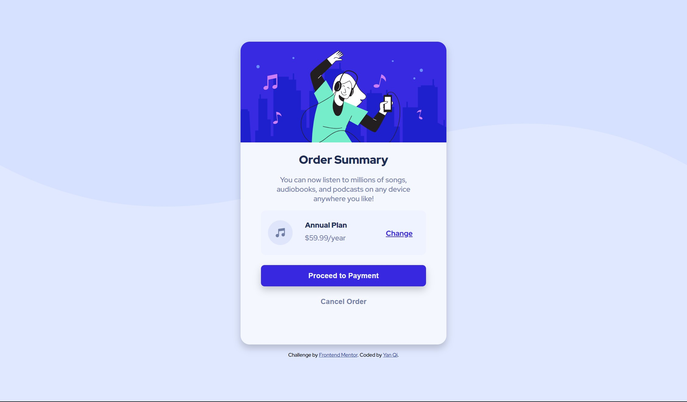

# Frontend Mentor - Order summary card solution

This is a solution to the [Order summary card challenge on Frontend Mentor](https://www.frontendmentor.io/challenges/order-summary-component-QlPmajDUj). Frontend Mentor challenges help you improve your coding skills by building realistic projects. 

## Table of contents

- [Overview](#overview)
  - [The challenge](#the-challenge)
  - [Screenshot](#screenshot)
  - [Links](#links)
- [My process](#my-process)
  - [Built with](#built-with)
  - [What I learned](#what-i-learned)
  - [Continued development](#continued-development)
<!-- - [Author](#author) -->

## Overview

### The challenge

Users should be able to:

- See hover states for interactive elements

### Screenshot



### Links

- Solution URL: [Github](https://your-solution-url.com)
- Live Site URL: [Github Pages](https://your-live-site-url.com)

## My process

### Built with

- Semantic HTML5 markup
- CSS custom properties
- Flexbox
<!-- - CSS Grid -->
- Mobile-first workflow

### What I learned

1. I learnt that background images can be position using ```background-position```

```css
.plan {
    background-image: url("./images/icon-music.svg");
    background-repeat: no-repeat;
    background-size: 15%;
    background-position: 15px;
}
```
2. Used ```positon: relative``` to position elements
```css
.plan a {
    float: right;
    color: var(--bright);
    font-weight: 700;
    position: relative;
    right: 10%;
    top: -35%;
}
```

<!-- If you want more help with writing markdown, we'd recommend checking out [The Markdown Guide](https://www.markdownguide.org/) to learn more. -->


### Continued development

<!-- Use this section to outline areas that you want to continue focusing on in future projects. These could be concepts you're still not completely comfortable with or techniques you found useful that you want to refine and perfect. -->
- Currently for the annual plan, pricing and change plan texts are position using relative. This is not the best way going forward as percentage to move might change(?) in regards to the screen size.

<!-- ## Author

- Website - [Add your name here](https://www.your-site.com)
- Frontend Mentor - [@yourusername](https://www.frontendmentor.io/profile/yourusername)
- Twitter - [@yourusername](https://www.twitter.com/yourusername) -->
